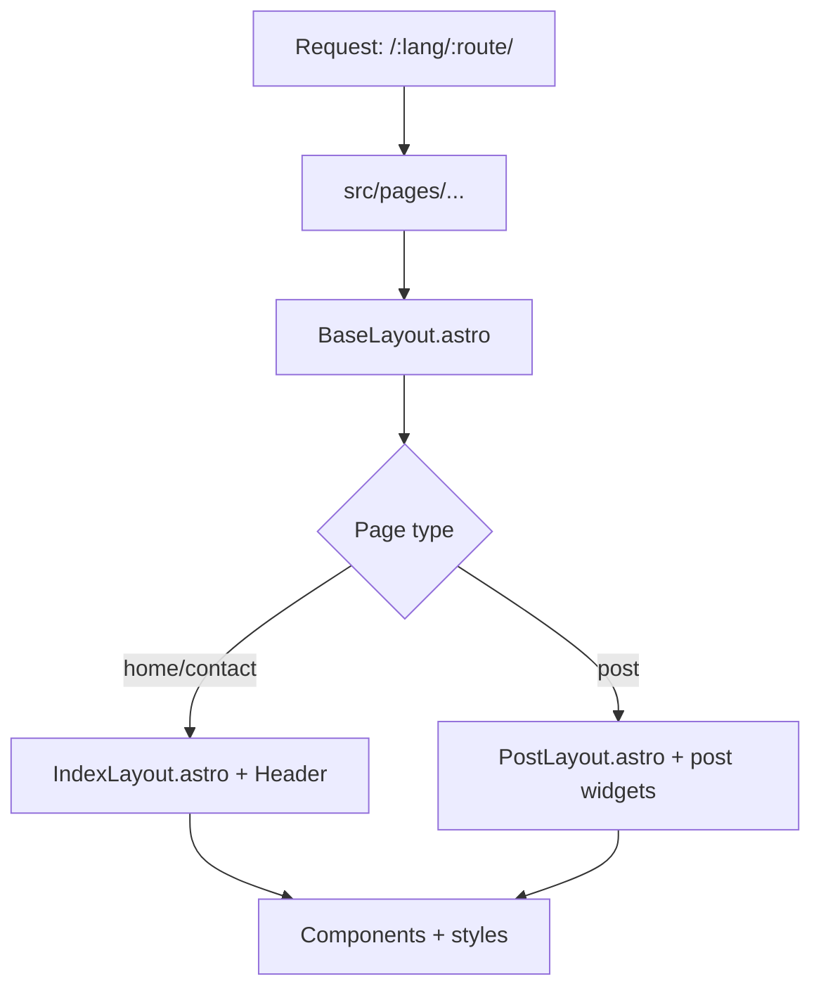
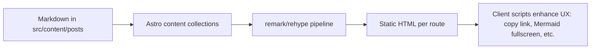
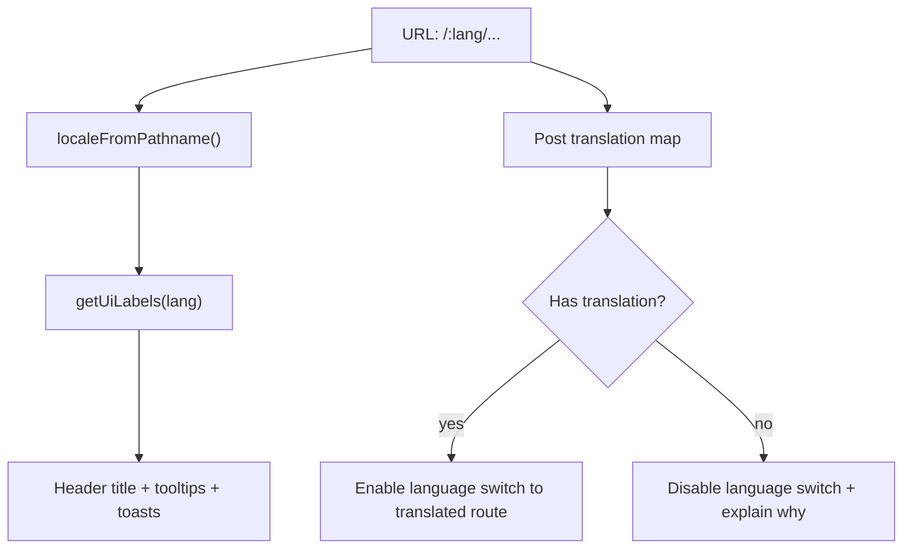
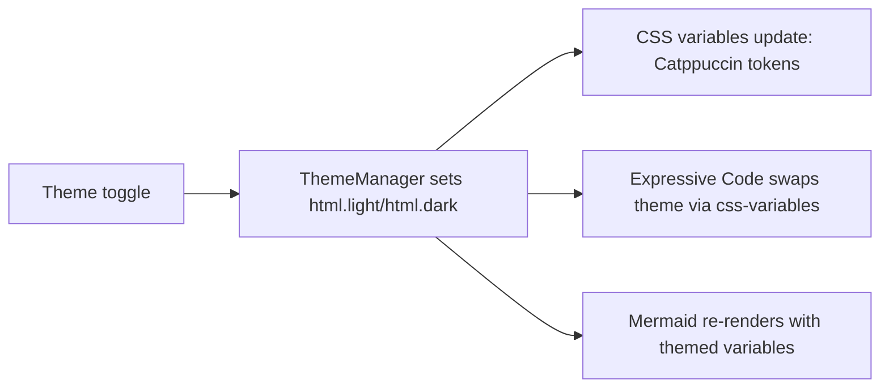
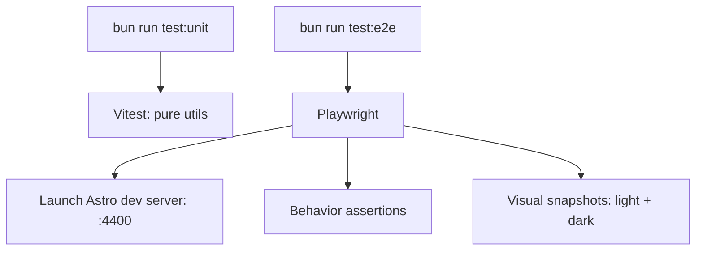
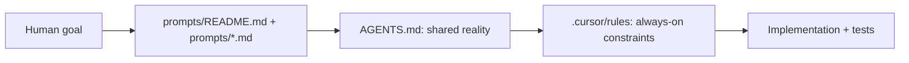

# sterlinghamilton.com

Sterling's personal site, built with **Astro** and managed with **Bun**.

If you're new here (chances are you are a one-time-visitor): you're safe. This README is meant to be a calm map of the repo.

## Upstream theme reference

This repo started from the Chiri Astro theme, but it has diverged a lot.

- Use the upstream guide for inspiration: `https://astro-chiri.netlify.app/theme-guide/`
- Do not follow its commands verbatim (it mentions pnpm and an `update-theme` script that we removed here).

## Table of contents

- [Quick start](#quick-start)
- [Common commands](#common-commands)
- [Project layout](#project-layout)
- [How the site works](#how-the-site-works)
  - [Routing + layouts](#routing--layouts)
  - [Content publishing (Markdown/MDX)](#content-publishing-markdownmdx)
  - [i18n (English/Spanish)](#i18n-englishspanish)
  - [Theme (light/dark)](#theme-lightdark)
- [Testing](#testing)
  - [Unit tests (Vitest)](#unit-tests-vitest)
  - [E2E + visual regression (Playwright)](#e2e--visual-regression-playwright)
- [AI prompts + rules](#ai-prompts--rules)
- [Upgrades](#upgrades)

## Quick start

Prereqs:
- Install **Bun** (and make sure it's reasonably recent).

Then:

```bash
bun install
bun dev
```

Open `http://localhost:4321/`.

## Common commands

All commands run from the repo root:

| Command | What it does |
| --- | --- |
| `bun install` | Install dependencies |
| `bun dev` | Run the dev server (`http://localhost:4321/`) |
| `bun run build` | Build the production site to `dist/` |
| `bun run preview` | Preview the production build locally |
| `bun run check` | Astro checks (typechecking + content validation) |
| `bun run lint` | Layered lint (Biome + whitespace + prose punctuation) |
| `bun run lint:fix` | Auto-fix lint issues (Biome + whitespace + prose punctuation) |
| `bun run lint:whitespace` | Whitespace lint (trailing spaces, final newline) |
| `bun run lint:prose` | Prose lint (plain keyboard punctuation only) |
| `bun run format` | Format with Biome |
| `bun run test:unit` | Run Vitest unit tests |
| `bun run test:e2e` | Run Playwright E2E (also used for visual diffs) |
| `bun run test:e2e:ui` | Playwright UI runner |

## Project layout

High-level structure (the 80/20 you'll actually touch):

```text
public/                   Static assets (favicon, logo, etc.)
src/
  components/             UI building blocks (Astro components)
  layouts/                Page templates (IndexLayout, PostLayout, BaseLayout)
  pages/                  Route entrypoints (Astro routing)
  scripts/                Client-side JS/TS (theme, mermaid, copy-link, etc.)
  styles/                 Global + post styles (Catppuccin tokens)
  utils/                  Small pure helpers (i18n, content selection, etc.)
  content/
    posts/                Blog posts (Markdown/MDX via content collections)
    about/                About blurb (localized)
tests/
  unit/                   Vitest unit tests
  e2e/                    Playwright E2E + visual regression
prompts/                  "Runbooks" for common tasks
.cursor/rules/            Cursor agent rules (always-on guidance)
AGENTS.md                 Agent guide + "shared reality" notes
```

## How the site works

### Routing + layouts

Routes are file-based:
- Home pages: `src/pages/[lang]/index.astro` → `/en/`, `/es/`
- Posts: `src/pages/[lang]/[...slug].astro` → `/:lang/:slug/`
- Contact: `src/pages/[lang]/contact.astro` → `/:lang/contact/`
- Convenience redirects:
  - `src/pages/index.astro` redirects `/` → `/:lang/` (prefers stored locale)
  - `src/pages/[...slug].astro` redirects legacy `/:slug/` → `/:lang/:slug/`

The layouts stack like this:
- `BaseLayout.astro` (global HTML shell, theme manager, toasts)
  - `IndexLayout.astro` (site pages)
  - `PostLayout.astro` (blog posts: TOC, headings, code, mermaid, etc.)

Here's the mental model:



### Content publishing (Markdown/MDX)

Posts live in `src/content/posts/`. Astro turns them into pages at build time.

Key bits:
- **Drafts**: files starting with `_` are excluded from routes/lists.
- Posts can include:
  - fenced code blocks (rendered via **astro-expressive-code**)
  - Mermaid blocks (rendered + enhanced client-side)
  - TOC + reading time (computed by remark plugins)



### i18n (English/Spanish)

Locales are configured in `src/config.ts`.

Rules we follow:
- Every post has a `lang` (`en` or `es`).
- Translations are linked with `translationKey`.
- The language toggle:
  - **stays on the same page** for normal routes (`/en/contact/` → `/es/contact/`)
  - is **disabled on posts** when a translation doesn't exist (so we don't lie)
- UI chrome is translated too (wordmark title, tooltips, toasts, etc.)

UI strings live in one place:
- `src/utils/i18n.ts` → `getUiLabels(locale)`



### Theme (light/dark)

Theme is controlled by the `html.light` / `html.dark` class.

Important: we intentionally configure code highlighting to follow that class (not `prefers-color-scheme`), so the site theme and code theme always match.



## Testing

We try to keep "shared reality": if we fixed it, we test it.

## Linting (layered)

Linting is intentionally layered so we catch both code issues and "repo hygiene" issues:

- Layer 1 (code): `biome check .`
  - Basic formatting and code linting
- Layer 2 (repo hygiene): `bun run lint:whitespace`
  - Trailing whitespace and final newline issues across tracked files
- Layer 3 (prose constraints): `bun run lint:prose`
  - Enforces plain keyboard punctuation only (see `.cursor/rules/35-plain-punctuation.mdc`)

The default `bun run lint` runs all layers.

Why we still run `bun run lint` even if the editor fixes things on save:
- Editor-on-save only affects files you touch. It can not tell you if some other tracked file already has trailing whitespace or weird punctuation.
- Our repo scripts scan git tracked files on purpose, so they catch issues anywhere in the tree, not just the file you just saved.

### Unit tests (Vitest)

- **Run**: `bun run test:unit`
- **Where**: `tests/unit/**/*.test.ts`
- **What to put here**: small pure helpers (i18n parsing, content selection, URL transforms)

### E2E + visual regression (Playwright)

- **Run**: `bun run test:e2e`
- Playwright starts its own dev server on `http://localhost:4400` (see `playwright.config.ts`)

Design choice (important):
- Our E2E + visual tests prefer **dev-only fixture routes** under `/debug/*` (for example `/debug/post/`, `/debug/mermaid/`).
- That means tests validate **behavior contracts** (TOC scroll, copy-to-clipboard + toast, Mermaid fullscreen, etc.) without depending on "whatever production post exists today".
- These fixtures are **404 in production** (guarded by `import.meta.env.PROD`), so they're safe to keep in the repo.

If you add a new UX feature and want it covered:
- Add a minimal fixture under `src/pages/debug/...` that exercises the DOM/behavior you care about
- Add a Playwright assertion that would have failed before the change

Visual regression:
- **Run (diff)**: `bunx playwright test tests/e2e/visual.spec.ts`
- **Update baselines**: `bunx playwright test tests/e2e/visual.spec.ts --update-snapshots`



## AI prompts + rules

This repo is set up so an AI assistant can be helpful *without* making a mess.

- `prompts/` contains task runbooks (start dev, upgrade deps, content authoring, writing voice).
  - Start with `prompts/README.md`.
- `AGENTS.md` describes the agent mission ("shared reality") and testing notes.
- `.cursor/rules/` contains always-on rules for Cursor (Bun usage, commit style, testing discipline, UI/i18n conventions).



## Upgrades

We keep upgrades boring:
- Use the prompt: `prompts/upgrade-dependencies.md`
- Verify with: `bun run check`, `bun run test:unit`, `bun run test:e2e`

Commit messages follow:
- `type(scope): message.` (always a scope, always ends with a period)
