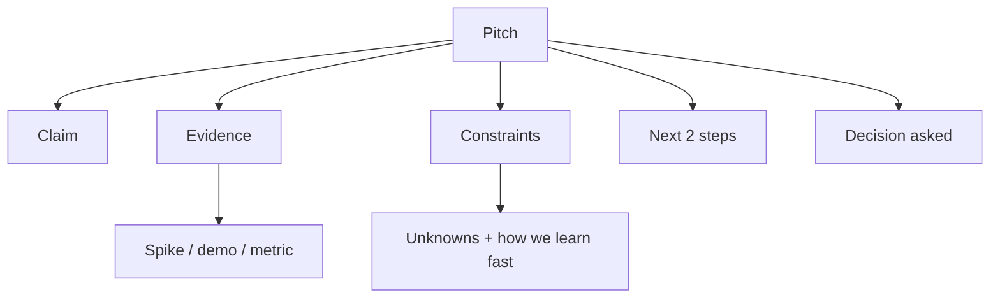

## TL;DR

If you want buy-in for a technical idea, sell what is true now.
Show a spike, a small demo, a measurable result.
Try not to sell a 6 month dream you cannot cash yet.

## The idea

When you pitch a technical idea to stakeholders, it is tempting to sell the future.
The potential. The vision. The roadmap.

I think that is a trap.

In most teams, deadlines matter and ROI matters. People need proof they can point at.
So instead of selling tomorrow, sell the now. Show current capability. Show the next 2 steps.

## Where I'm coming from

This is a pattern I've seen across a few different worlds.

I started in agencies, where you learn quickly that confidence is not the same as certainty.
Then I worked with small businesses, where cash flow is the deadline and "later" is not a plan.
Now in fintech, the stakes are higher and the constraints are real: compliance, risk, and the cost of being wrong.

None of that makes me special. It just means I've watched the same mistake show up in different outfits.

## Why it happens

- **It feels safer**: A shiny future story is easier than a small, messy prototype.
- **Incentives push it**: "Big vision" sounds like leadership, even when it is mostly vibes.
- **Time horizons collide**: Engineers think in systems. Managers think in quarters. Both are valid.
- **Fear and uncertainty**: If you cannot prove it, you might try to persuade harder.
- **Misaligned metrics**: You get rewarded for pitching, not delivering.

## What it costs

Selling tomorrow is not just unattractive. It is expensive.

- **Trust**: If your plan depends on unknowns, it will eventually crack. People remember.
- **Time**: Teams burn weeks chasing a story that was never grounded.
- **Focus**: A big roadmap becomes a magnet for scope creep.
- **Morale**: Nobody likes being the crew that keeps propping up the same house of cards.

## How to avoid it

### Principle 1: Prove it in the smallest honest way

If the idea is real, you can demonstrate some part of it quickly.
Not the whole thing. Just the core claim.

Example: if you are proposing a new service, prove you can move one request end to end.
Measure latency. Show logs. Show the rough edges. That is fine.

### Principle 2: Make your pitch about constraints, not just outcomes

Stakeholders do not need a fantasy. They need a plan that survives contact with reality.
Talk about what is hard, what is risky, and what you will do if it goes sideways.

It is weirdly comforting when someone says, "Here is what we do not know yet."

### Principle 3: Offer the next two steps, not the next two quarters

Roadmaps are fine. But your pitch should still anchor on the next steps you can take now.
If you cannot name the next two steps, you are probably selling tomorrow.

## A pitch template that sells the now

When I am trying to get a technical idea approved, this is what I aim for:

- **Claim**: one sentence.
- **Evidence**: a spike, a small demo, a metric, or a screenshot.
- **Constraints**: what is hard, what could fail, what depends on other teams.
- **Next 2 steps**: timeboxed and specific.
- **Decision**: what you need from them (approval, time, budget, a yes or no).

Stakeholders are not being difficult. They are carrying risk you do not see.
The more you make the risk visible and manageable, the easier it is to get support.

## A practical checklist

I get why people sell tomorrow. You want to show you are thinking big, and you want to protect your idea from getting killed early.
But in my experience, the fastest way to lose support is to ask for belief when you could ask for a small, timeboxed experiment.
People are not allergic to ambition. They are allergic to uncertainty dressed up as certainty.

- [ ] Can I show a spike, demo, or measurement from the current system?
- [ ] Can I explain the core claim in one sentence?
- [ ] Did I name the biggest unknown and how we will learn it quickly?
- [ ] Did I propose the next two steps with a timebox?
- [ ] Did I avoid promising outcomes that depend on untested assumptions?

## Closing

If you want support for technical work, try not to sell tomorrow.
Sell what is true now, and sell the next two steps.

Your stakeholders get results they can point at.
And you get to build on reality, not on vibes.

