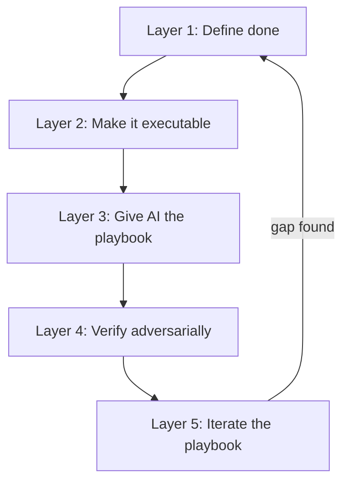
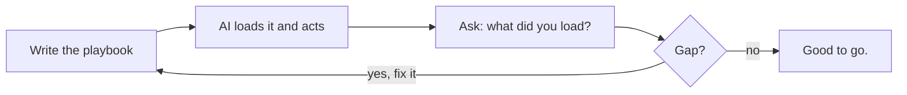

Most AI failures aren't model failures. They're definition failures.

The model did exactly what you said. The problem is that what you said wasn't what you meant.

That gap has a name: **shared reality**. Closing it is the most leveraged thing you can do when working with AI.

## TL;DR

AI does exactly what you say, not what you mean. The fix is to build shared reality on purpose: define your words, define what done looks like, and put something in place that lets you actually verify what you got back. Your repo, your prompts, and your process are the spec. Treat them that way.

## A Concrete Example First

You can't run "a play." You run _the_ play.

Every player on the field knows the same terminology, the same routes, the same signals.
If the coach says "run 42" and you run the version of 42 you invented in your head, that's not creativity.
That's a polite way to lose.

Working with AI is exactly this. Except when AI runs the wrong play, it doesn't hesitate or look confused.
It runs the wrong play at full speed, with confidence, and hands you the result like it just won the game.

## What Is Shared Reality?

> **Reality** is the state of everything that exists, not how they might be imagined.  
> - <cite>Wikipedia[^1]</cite>

[^1]: [Reality](https://en.wikipedia.org/wiki/Reality) on Wikipedia. The article defines reality as the state of everything that actually exists, as distinct from how things might be imagined or perceived. Useful grounding for a concept most people never bother to define.

Humans share reality without thinking about it. Same year. Same gravity. Same vague understanding of what "ship it" means. We fill gaps with context, tone, and history.

AI doesn't have that. It has the context you gave it. That's it.

There's a useful distinction here, between *consensus* reality and *consensual* reality.[^2]

[^2]: [Consensus Reality](https://en.wikipedia.org/wiki/Consensus_reality) on Wikipedia. Covers the difference between consensus (the outcome a group lands on) and consensual (the process of actually opting in and agreeing). That distinction is the whole point of this article.

- **Consensus reality** is the outcome: what a group ends up treating as true. It could come from careful alignment, or it could come from one loud person winning the meeting.
- **Consensual reality** is the process: people actually opted in, defined the terms, and agreed on the rules.

What we want with AI is the second one.
Not "I guess we both ended up here." But "we agreed on this, explicitly, on purpose."

Shared reality is the agreement underneath the agreement:

- What do the words mean?
- What does "done" look like?
- What counts as good?

Without it, you're not collaborating. You're just taking turns making noise at each other. 😵

## What Failure Actually Looks Like

Here's a failure mode you probably have a version of already.

You write a prompt. AI returns code. It looks right. Your tests pass. You ship it.
Six weeks later, a user hits an edge case. You dig in and realize the AI solved a slightly different problem than the one you actually had.
It threaded the needle perfectly, on the wrong problem.

You can't even trace where it broke, because there were no checkpoints. No explicit definition of "done." No verification that the output matched the intent.
Just "this looks right" and a commit.

The worst version of this isn't a bug. It's an entire architecture built around a misunderstanding.

Here are a few smaller versions that happen every day:

- You can have agent code that passes tests but isn't working as intended.
- The AI says "mission complete" and it is very much not.
- Commands run with the wrong environment, or inside the wrong sandbox.
- Artifacts pile up in your workspace and never get used.
- You think you're building layered prompt instructions, but every conversation is actually a blank slate.

If you don't have shared reality, you won't know what a good solution looks like until you've already built the bad one.

## Why AI Makes This More Urgent

Humans fail at shared reality too.

We say "done by Friday" and mean "I'll start Thursday night." We hand-wave. We change our minds. We fill gaps with assumptions.

AI doesn't fill gaps with assumptions. It fills gaps with whatever the training data suggests is most likely. Those are not the same thing.

Worse: AI doesn't slow down when confused. It just produces wrong output faster.

Imagine hiring 500 smart interns who can move at machine speed.
Not senior engineers. Not people who already know how you do things.
Smart interns who will confidently do the wrong thing if you're vague.

You'd never rely on vibes with an onboarding wave that big. You'd lay groundwork:

- **Definitions:** What does "ship" mean here, exactly?
- **Standards:** What are the naming conventions, commit formats, and definition of done?
- **Guardrails:** What linting, tests, and CI checks are non-negotiable?
- **Verification:** How do you prove the work is good, and not just that it looks good?

That's not bureaucracy. That's compassion for Future You.

With AI, you can onboard 500 of those interns in an afternoon.
So the cost of skipping that groundwork shows up much, much faster.

## What Good Looks Like

Here's the part people skip: good isn't a vibe. Good is a definition.

If you can't describe what "done" looks like without using the word "looks," you don't have a definition yet.

Here's a model that works, in layers:

**Layer 1: Define done precisely.**  
Not "working." Provably done.
What test passes? What lint rule runs? What snapshot matches? What API response is acceptable?
Write the definition before you write the prompt.

**Layer 2: Make the standard executable.**  
A rule in a README is a suggestion. A rule in a linter, a test, or a CI check is a constraint.
AI can work inside constraints. It will casually ignore suggestions when they're inconvenient.
If it matters, make it run.

**Layer 3: Give AI your playbook.**  
This is your AGENTS.md, your prompts folder, your style guide, your naming conventions, everything that answers "how do we do things here?"
If you don't write it down, AI guesses. If you write it down badly, AI guesses confidently.
Write it well and AI starts to feel like a good hire on day two.

**Layer 4: Verify adversarially.**  
The best check on AI output is a second pass that assumes the first answer was wrong.

Some people formalize this. Verified Spec-Driven Development (VSDD)[^3] takes it seriously enough to run a separate AI model, literally named "Sarcasmotron," whose only job is to find gaps in specs, tests, and implementation. The idea: if your shared reality is solid, adversarial review should bounce off it. If it breaks, you found out cheaply, before shipping.

[^3]: [Verified Spec-Driven Development (VSDD)](https://gist.github.com/dollspace-gay/d8d3bc3ecf4188df049d7a4726bb2a00) is a methodology that formalizes spec, test, implementation, and adversarial review as a sequential pipeline.

**Layer 5: Iterate the playbook, not just the output.**  
When AI makes a mistake, don't just fix the code. Ask what rule was missing and what was undefined.
Then add that to Layer 1 or 2. The goal isn't a perfect prompt. It's a system that gets sharper over time.

When this is working well, things look like this:

- AI confirms a problem actually exists before jumping to a solution.
- Solutions get verified with tests, E2E runs, and real checks, not just a quick eyeball.
- AI pushes back when you ask it to do something bad.
- Mistakes are traceable, so you can fix the process and not just the output.

## Your Repo Is the Prompt

Here's the part most people miss.

AI reads your codebase like a library of hints.
Every file name, every variable name, every half-finished comment, every test that says `// TODO: actually test this` is context. It all shapes what AI thinks you want.

If your repo is inconsistent, AI learns inconsistency.
If it's explicit and well-tested, AI gets better at helping you.

Not because of magic. Because you gave it better material to work with.

That means how you maintain your codebase is also, now, how you communicate with your AI tooling.

- The README is the spec.
- The tests are the definition of done.
- The lint rules are the standards.
- The commit messages are the history.
- The prompts folder is the playbook.

Write them for a fast, smart, zero-context collaborator who can only know what you put in the repo.

You're not writing documentation. You're writing the shared reality.

## It's an Open Book

Here's a property of AI that most people don't think to use: you can just ask.

AI is the first collaborator you've ever had that will tell you, directly and honestly, what context it loaded, what rules it thinks it's working under, and why it made a choice.

If something comes out wrong, you don't have to guess what happened. You can ask "what rules are you working with right now?" and it will tell you. You can ask "why did you choose that approach?" and it will explain. You can ask "what do you think the definition of done is here?" and it will show you its current understanding.

That's not something you can do with a human teammate. People have gaps in what they know, gaps in what they'll admit to, and a whole set of social reasons not to say "actually, I have no idea what the standard is here."

AI has none of that friction.

This makes the loop tight. You write the playbook. You give it to AI. You can then ask AI to read it back. If what comes back doesn't match what you wrote, the gap is real and now it's visible. You can fix it before it becomes a six-week problem.

Think of it less like delegating to a black box, and more like pair programming with someone who will always be honest about what they understood from the brief.

That bidirectional check is part of what makes this different from every other tool in your stack. Use it.

## The Real Claim

The model isn't your bottleneck. Your clarity is.

AI is powerful enough right now that the limiting factor in most workflows is the human on the other end,
not having a clear definition of what they want, what done looks like, or what good means.

That's not a technical problem. It's a communication problem.

And shared reality is how you fix it. You get fewer surprises. You do less rework. You build more trust that what got built is actually what you asked for.

AI can help you build anything. But it can't guess your standards, fix a missing objective, or read your mind.

So be the coach who wrote the playbook, not the one who said "you know, run the play."
