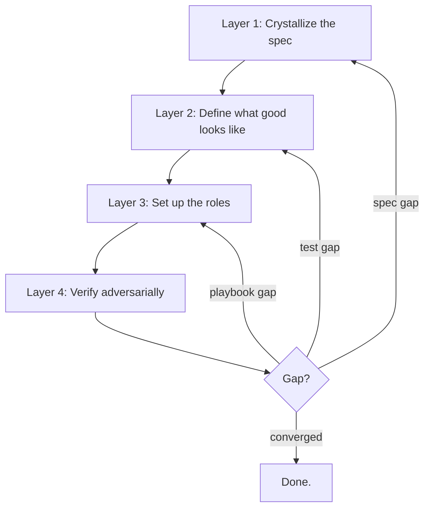
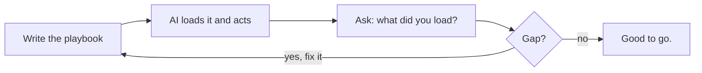

When you're having a bad time with AI, from my experience it's not a failure of the technology. 
It's a failure of being on the same planet, at the same time, in the same space.

The model did exactly what you said. The problem is that what you said wasn't what you meant.

You knew what you wanted. You said something close to it. The model had no way to tell the difference. That has a name: **shared reality**.

Get it right and AI starts to feel like a real collaborator. Get it wrong and you spend your time correcting output that executed flawlessly on the wrong brief.

## TL;DR

AI does exactly what you say, not what you mean. The fix is to build shared reality on purpose: define what done looks like before you touch a prompt, give AI the full context it needs to reason correctly, set up clear roles for who does what, and verify the result with something that wasn't the thing that made it. Your context, your prompts, and your process are the spec. Treat them that way.

## A Concrete Example First

You can't run "a play." You run _the_ play.

Every player on the field knows the same terminology, the same routes, the same signals.
If the coach says "run 42" and you run the version of 42 you invented in your head, that's not creativity.
That's a polite way to lose.

Working with AI is exactly this. Except when AI runs the wrong play, it doesn't hesitate or look confused.
It runs the wrong play at full speed, with confidence, and hands you the result like it just won the game.

## What Is Shared Reality?

> **Reality** is the state of everything that exists, not how they might be imagined.  
>
> - <cite>Wikipedia[^1]</cite>

[^1]: [Reality](https://en.wikipedia.org/wiki/Reality) on Wikipedia. The article defines reality as the state of everything that actually exists, as distinct from how things might be imagined or perceived. Useful grounding for a concept most people never bother to define.

Humans share reality without thinking about it. Same year. Same gravity. Same vague understanding of what "ship it" means. We fill gaps with context, tone, and history.

AI doesn't have that. It has the context you gave it. That's it.

There's a useful distinction here, between _consensus_ reality and _consensual_ reality.[^2]

[^2]: [Consensus Reality](https://en.wikipedia.org/wiki/Consensus_reality) on Wikipedia. Covers the difference between consensus (the outcome a group lands on) and consensual (the process of actually opting in and agreeing). That distinction is the whole point of this article.

- **Consensus reality** is the outcome: what a group ends up treating as true. It could come from careful alignment, or it could come from one loud person winning the meeting.
- **Consensual reality** is the process: people actually opted in, defined the terms, and agreed on the rules.

What we want with AI is the second one.
Not "I guess we both ended up here." But "we agreed on this, explicitly, on purpose."

Shared reality is the agreement underneath the agreement:

- What do the words mean?
- What does "done" look like?
- What counts as good?

Without it, you're not collaborating. You're just taking turns making noise at each other.

## What Failure Actually Looks Like

Here's a faceplant you probably have a version of already.

You ask AI to write a follow-up after a sales call. It comes back polished and professional. You send it. The prospect goes quiet. Looking back, the email missed the specific concern they raised, didn't match the casual tone you'd built, and led with product features instead of the outcome they actually cared about. You never told AI any of that.

Or you write a prompt, AI returns code, the tests pass, you ship it. Six weeks later, a user hits an edge case. The AI solved a slightly different problem than the one you had. It threaded the needle perfectly - on the wrong problem.

The output wasn't wrong. It was answering a slightly different question than the one you actually had. In both cases: no checkpoints. No explicit definition of done. No verification that the output matched the intent. Just "this looks right" and a send.

The worst version of this isn't a wrong email or a bug. It's an entire direction built around a misunderstanding.

Smaller versions happen every day:

- A drafted email is technically correct but misses the relationship context that was never written down.
- A campaign brief is thorough but omits the positioning decision made in last month's meeting.
- An AI agent says "done" and it is very much not.
- You think AI remembers the context from your last conversation. It doesn't. Every session starts fresh.
- You think you're being clear. AI is executing on a slightly different interpretation of your words.

If you don't have shared reality, you won't know what a good result looks like until you've already produced the bad one.

## Why AI Makes This More Urgent

Humans fail at shared reality too.

We say "done by Friday" and mean "I'll start Thursday night." We hand-wave. We change our minds. We fill gaps with assumptions.

AI doesn't fill gaps with assumptions. It fills gaps with whatever the training data suggests is most likely. Those are not the same thing.

Worse: AI doesn't slow down when confused. It just produces wrong output faster.

Imagine hiring 500 smart interns who can move at machine speed.
Not senior engineers. Not people who already know how you do things.
Smart interns who will confidently do the wrong thing if you're vague.

You'd never rely on vibes with an onboarding wave that big. You'd lay groundwork:

- **Definitions:** What does "done" mean for this task, exactly?
- **Standards:** What's the tone, format, level of detail, and style that makes this right?
- **Constraints:** What are the non-negotiables - policy, brand, legal, technical?
- **Verification:** How do you prove the output is good, and not just that it looks good?

That's not bureaucracy. That's compassion for Future You.

With AI, you can onboard 500 of those interns in an afternoon.
So the cost of skipping that groundwork shows up much, much faster.

## What Good Looks Like

Here's the part people skip: good isn't a vibe. Good is a definition.

If you can't describe what "done" looks like without using the word "looks," you don't have a definition yet.

Here's what that actually looks like, broken into layers:

**Layer 1: Crystallize the spec.**  
Not "done." Provably done - and written down before any code or prompts exist.

Start with the why. Before behavioral contracts or interface definitions, write one or two sentences: why does this exist, and what would make it a failure at a level above the tests passing? A filter function that's technically correct but too slow for the dashboard it serves failed. A follow-up email that's well-written but misses the prospect's actual concern failed. **The why defines what tradeoffs are acceptable and shapes every decision downstream.** _AI can't infer it from the spec - you have to say it._

Then: behavioral contracts (what does this actually do?), interface definitions (what does it take, what does it return?), and an edge case catalog (what are all the ways this can fail?). It also means deciding upfront which properties need formal verification and which just need tests. Not everything requires a proof. But you should know which things do before you start building.

**Write the spec before you write the prompt.**

**Layer 2: Define what good looks like - before you ask for it.**  
**A standard in your head is a suggestion. A standard written down is a constraint.** The sequence matters.

Before you prompt, write down what a good result looks like. What must be true? What would make you send it back? What does bad look like, specifically? If you can't answer those before asking, you're not ready to ask.

For engineers: write the tests before the implementation. Run them, watch them fail, then let AI write the minimum code to make them pass. _If you write tests after the code, you're documenting what was built, not verifying what you wanted._ Linting, CI checks, and any formal verification tools flagged in Layer 1 go here too. **If it matters, make it run. If it runs and fails, nothing ships.**

**Layer 3: Set up the roles.**  
This is your `AGENTS.md`, your prompts folder, your style guide, your naming conventions - everything that answers "how do we do things here?"

But it also means being explicit about who does what. Three roles matter: the **Builder** (the AI doing the implementation), the **Adversary** (a separate AI whose only job is to find what the Builder missed), and the **Architect** (you - making strategic calls, not implementation calls). If you don't separate these roles, you end up asking the same model to build and verify its own work. _That's not adversarial review. That's asking someone to grade their own exam._

**If you don't write the playbook down, AI guesses. If you write it down badly, AI guesses confidently.** Write it well, set up the roles, and things start to feel like a team.

**Layer 4: Verify adversarially - with a separate model.**  
_The best check on AI output is a second pass that assumes the first answer was wrong._ And the second pass needs to come from a different model, loaded with fresh context.

This is what VSDD[^3] calls the Adversary - a separate AI (literally named "Sarcasmotron" in the spec) whose only job is to find gaps in the spec, the tests, and the implementation, examined together. Not "does this look right?" but "what is wrong with each of these three things, and where do they fail to match each other?"

The Builder model has been reasoning toward a solution. _The Adversary comes in cold and looks for cracks._ **If your shared reality is solid, adversarial review should bounce off it. If it breaks, you found out before shipping.**

[^3]: [Verified Spec-Driven Development (VSDD)](https://gist.github.com/dollspace-gay/d8d3bc3ecf4188df049d7a4726bb2a00) combines Spec-Driven Development, Test-Driven Development, and adversarial verification into a formal pipeline: crystallize the spec → write failing tests → implement → adversarial review (Sarcasmotron) → feedback to the right phase → formal hardening → convergence. The exit condition: the adversary is forced to invent problems that don't exist.

**Layer 5: Iterate the right layer - not just the output.**  
When the adversary finds a gap, it came from somewhere. A spec gap goes back to Layer 1. A test gap goes back to Layer 2. A playbook or role gap goes back to Layer 3. _Fixing code without updating the layer that caused the mistake means you'll hit the same gap again, shaped differently._

The goal isn't a perfect prompt. It's a system that converges. VSDD's exit condition is concrete: you're done when the adversary is forced to invent problems that don't exist. That's what "good" actually looks like.

When this is working well, things look like this:

- Specs exist before prompts do.
- Tests fail before code does.
- A different model finds what the first one missed.
- Gaps go back to the right layer - spec, tests, or playbook.
- You stop when the adversary runs out of real problems to find.

## Your Context Is the Prompt

Here's the part most people miss.

AI builds its model of what you want from everything you give it. The message in the chat window is just the top layer. Under it is everything you've attached, pasted, described, or shared. Under that is everything you didn't include, which AI fills in with probability.

What that context looks like depends on how you work.

For a salesperson, it's the prospect's emails, the CRM notes, the specific objection raised on the last call, the tone that's been established over months. For a marketer, it's the brand guide, the positioning statement, the audience research, and two examples of copy that felt exactly right. For someone in operations or support, it's the policy doc, the customer's history, and the cases where exceptions were made and why.

For an engineer, it's the codebase. Every file name, every variable name, every half-finished comment, every test that says `// TODO: actually test this` is context. It all shapes what AI thinks you want.

The source changes. The principle doesn't: precise context produces precise output. Vague context leaves AI guessing.

That means how you maintain your working materials is also, now, how you communicate with AI.

For engineers specifically:

- The README is the spec.
- The tests are the definition of done.
- The lint rules are the standards.
- The branch names are the intent.
- The commit messages are the history.
- The pull requests are the decisions.
- The prompts folder is the playbook.

This used to be overhead. You named branches because they needed names. You wrote commit messages because convention said to. You filled in the PR description because someone would skim it before merging.

AI doesn't skim. It reads all of it and uses it to build a model of what you're trying to do.

The same is true everywhere else. "Write me a follow-up email" is noise. "Write a follow-up to Sarah at Acme, who raised a budget concern last call, prefers casual tone, and cares most about time-to-value" is a precise signal - and that precision affects every inference AI makes about what to write. "fix auth" is noise. "fix OAuth token refresh race on concurrent requests" is a precise signal.

The gap between "good enough for a person who can ask a follow-up question" and "good enough for AI" is precision. Humans fill gaps with social context: who worked on this, what the conversation was, what was obvious at the time. AI fills gaps with probability. Probability is not your intent.

There used to be a recovery channel. If something was vague, you could ask. Slack, a quick call, the person next to you. AI has what you gave it. That's it. The context that lived in your head or in a meeting now has to live in what you provide.

Write it for someone brilliant who started today and only knows what's in front of them.

You're not writing documentation. You're writing the shared reality.

## It's an Open Book

Here's a property of AI that most people don't think to use: you can just ask.

AI is the first collaborator you've ever had that will tell you, directly and honestly, what context it loaded, what rules it thinks it's working under, and why it made a choice.

If something comes out wrong, you don't have to guess what happened. You can ask "what rules are you working with right now?" and it will tell you. You can ask "why did you choose that approach?" and it will explain. You can ask "what do you think the definition of done is here?" and it will show you its current understanding.

That's not something you can do with a human teammate. People have gaps in what they know, gaps in what they'll admit to, and a whole set of social reasons not to say "actually, I have no idea what the standard is here."

AI has none of that friction.

This makes the loop tight. You write the playbook. You give it to AI. You can then ask AI to read it back. If what comes back doesn't match what you wrote, the gap is real and now it's visible. You can fix it before it becomes a six-week problem.

Think of it less like delegating to a black box, and more like pair programming with someone who will always tell you exactly what they understood.

That feedback loop is something you don't get with any other tool. Use it.

## When It Actually Works

When shared reality is solid, the dynamic shifts in ways you don't expect.

**AI enforces your own rules back at you.** You ask for something that conflicts with a constraint you set six months ago and forgot about. AI flags the conflict instead of executing. The rule was there. You weren't. The system was.

**AI knows exactly where the gap is.** Instead of producing something plausible-but-wrong, it stops and asks one specific question - the one thing that's actually unresolved. That only happens when shared reality is strong enough that AI knows where the ambiguity is, not just that ambiguity exists somewhere.

**Constraints produce surprises.** AI generates something you wouldn't have thought of. You check it against your positioning, your brand guide, your examples of what right looks like. It's inside every boundary you set - and it's better than what you would have written. Precise constraints don't narrow the output. They define the space that good output lives in.

**Expertise stops living only in people's heads.** You bring on a new team member and give them AI with a well-built playbook. By day two, their output looks like your best person's. Not because they're already experienced. Because the experience is in the system now, not trapped in one person's institutional memory.

**Problems surface before they compound.** You update a requirement. AI flags three things downstream that now conflict with it - before any of them ships. Not because it's doing something sophisticated. Because the dependencies were explicit enough to be findable.

The pattern in all of these: nothing magic happened. The shared reality was just good enough that AI could reason correctly - and when it couldn't, it knew where to stop.

## What This Doesn't Give You

Shared reality ensures AI builds the right thing. It doesn't ensure you understand what was built. Those are different problems with different failure modes.

AI's velocity makes the second problem easy to ignore. You can accumulate work - a codebase, a campaign, a body of decisions - that functions exactly as specified. The tests pass. The adversary finds nothing. Everything looks right. And you have no clear picture of what you actually have, or why it works, or what happens when something outside the spec occurs.

There's a framing worth borrowing: code has become cheaper to produce than to perceive.[^4] The same is true for any work AI produces. Output accumulates faster than understanding can keep up. Shared reality doesn't fix that. It can mask it - because everything working as specified is a convincing signal that you know what you have. It isn't.

[^4]: [Cognitive Debt: When Velocity Exceeds Comprehension](https://www.rockoder.com/beyondthecode/cognitive-debt-when-velocity-exceeds-comprehension/) - argues that AI-assisted development decouples production from comprehension, creating invisible organizational debt that only surfaces through lagging indicators like increased failure rates.

Use AI to go faster. Don't use it to skip the thinking. Shared reality transfers execution.

**Understanding is still your job.**

## The Thing Worth Actually Saying

The model isn't your bottleneck. Your spec is.

Not your prompt. Your spec. AI is powerful enough right now that the limiting factor in most workflows is whether you've actually defined what done means - formally enough to test it, adversarially enough to stress it, precisely enough for something to build against.

That's not a technical problem. It's a discipline problem.

Shared reality is how you fix it. A clear definition of done before you touch a prompt. A second check on the output that wasn't the thing that made it. Feedback that goes back to where the misunderstanding started - not just patched at the surface. And an exit condition you can actually check.

AI can help anyone build anything. But it can't define your outcome, surface the context you left out, or find its own blind spots.

So be the Architect. Write the playbook. Let the Builder build and the Adversary break it. Stop when the Adversary runs out of real problems.
